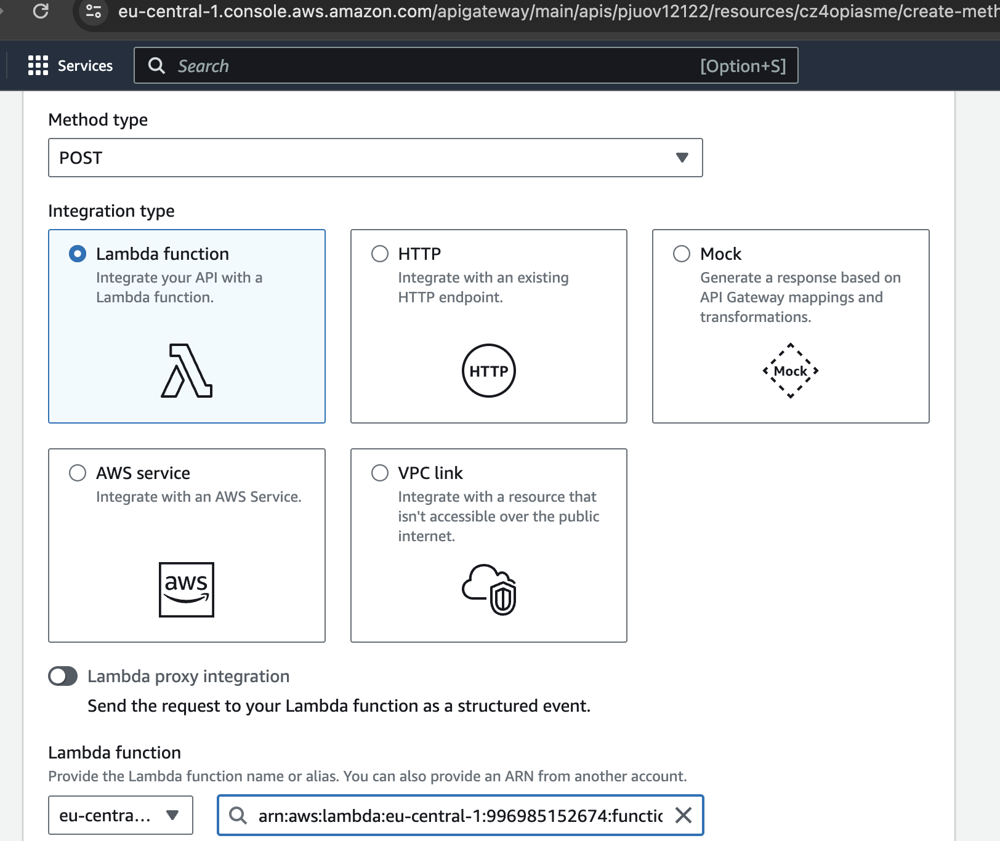

To generate the the arm 64 binary
```
GOOS=linux GOARCH=amd64 CGO_ENABLED=0 go build -o main main.go
```

To make the zip file

```
zip main.zip ./main
```
Go to the console.aws.amazon.com
- Create account
- Create a lambda function on the AWS
Update the handler from by default hell to main


Add the JSON into the lambda testing


Run the lambda into the AWS


Call the URL from postman
```
curl --location 'https://pjuov12122.execute-api.eu-central-1.amazonaws.com/hellowithname' \
--header 'Content-Type: application/json' \
--data '{
  "firstname": "yagnik",
  "lastname": "pokal"
}'
```
