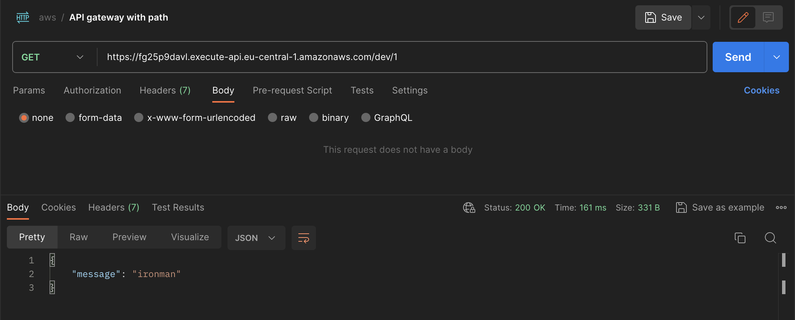
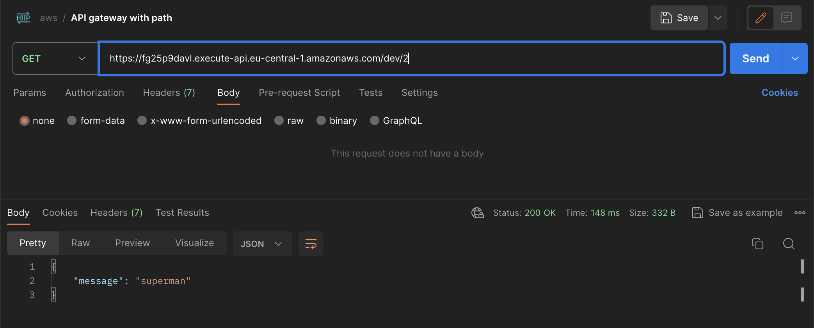

To generate the the arm 64 binary
```
GOOS=linux GOARCH=amd64 CGO_ENABLED=0 go build -o main main.go
```

To make the zip file

```
zip main.zip ./main
```
Go to the console.aws.amazon.com
- Create account
- Create a lambda function on the AWS
Update the handler from by default hello to main


Call the api with ID 1
```
curl --location 'https://fg25p9davl.execute-api.eu-central-1.amazonaws.com/dev/1'
```


Call the api with ID 2
```
curl --location 'https://fg25p9davl.execute-api.eu-central-1.amazonaws.com/dev/2'
```
