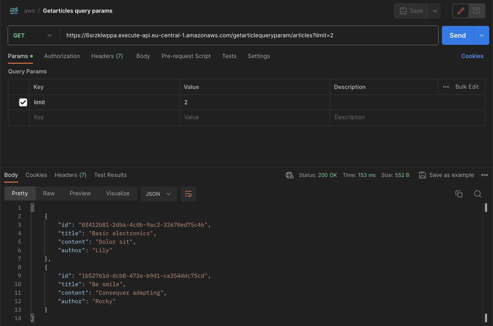
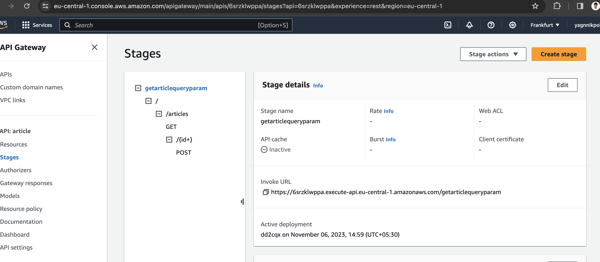
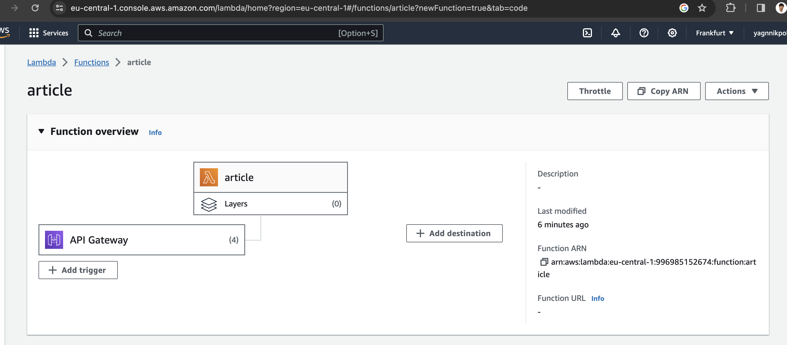
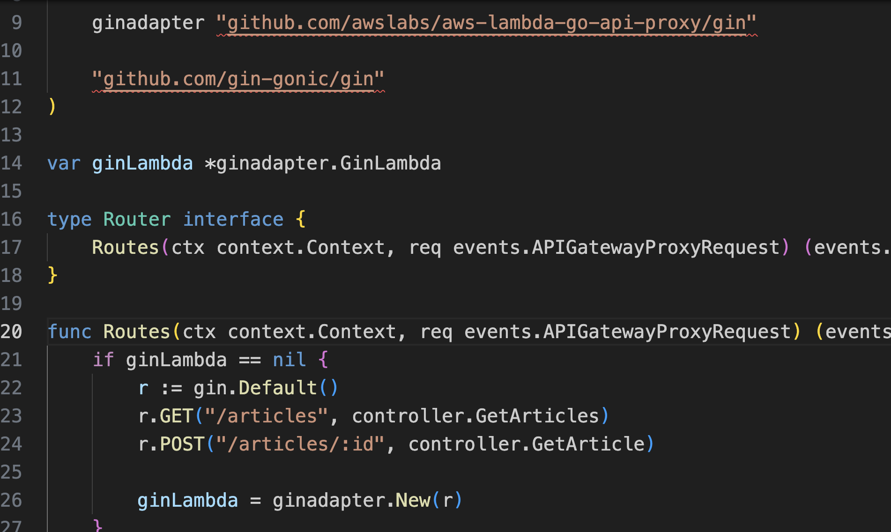

To generate the the arm 64 binary
---
```
GOOS=linux GOARCH=amd64 CGO_ENABLED=0 go build -o main main.go
```

To make the zip file
--
```
zip main.zip ./main
```
Go to the console.aws.amazon.com
---
- Create account
- Create a lambda function on the AWS
Update the handler from by default hello to main
---

Query parameter
---
```
curl --location 'https://6srzklwppa.execute-api.eu-central-1.amazonaws.com/getarticlequeryparam/articles?limit=2'
```
---

---
Path parameter
---
```
curl --location --request POST 'https://6srzklwppa.execute-api.eu-central-1.amazonaws.com/getarticlequeryparam/articles/1'
```
---
](docs/image-1.png)
---
API Gateway routes

--
Single lambda function used for both the routes

---
GIN framework with the lambda 

---
Referance
---
https://github.com/awslabs/aws-lambda-go-api-proxy/tree/master/sample

https://github.com/yagnikpokalperennialsys/blogsystem

---


