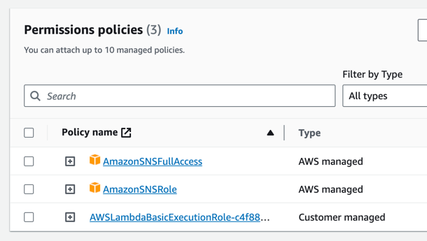
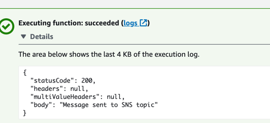

To generate the the arm 64 binary
---
```
GOOS=linux GOARCH=amd64 CGO_ENABLED=0 go build -o main main.go
```

To make the zip file
--
```
zip main.zip ./main
```
Add the permission policy to send message from lambda to SNS


Send a message from lambda 1
