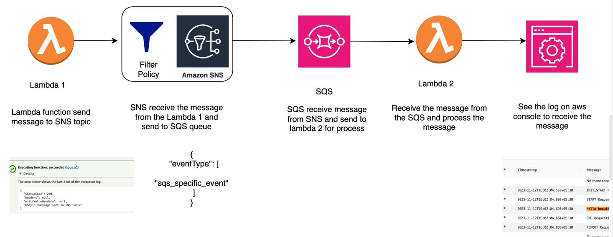
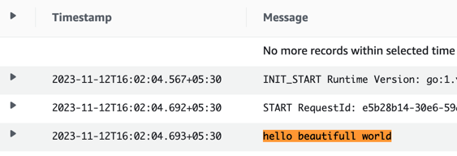
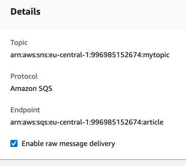

Flow diagram

Message travelling from lambda1 -->> SNS with filter policy -->> SQS-->> lambda2

### Important note
While sending a message from SNS to SQS it is mandatory to use row message enabled. Else message send from the lambda1 to SQS to SQS will not be able to process.

### Referances
https://stackoverflow.com/questions/44238656/how-to-add-sqs-message-attributes-in-sns-subscription

