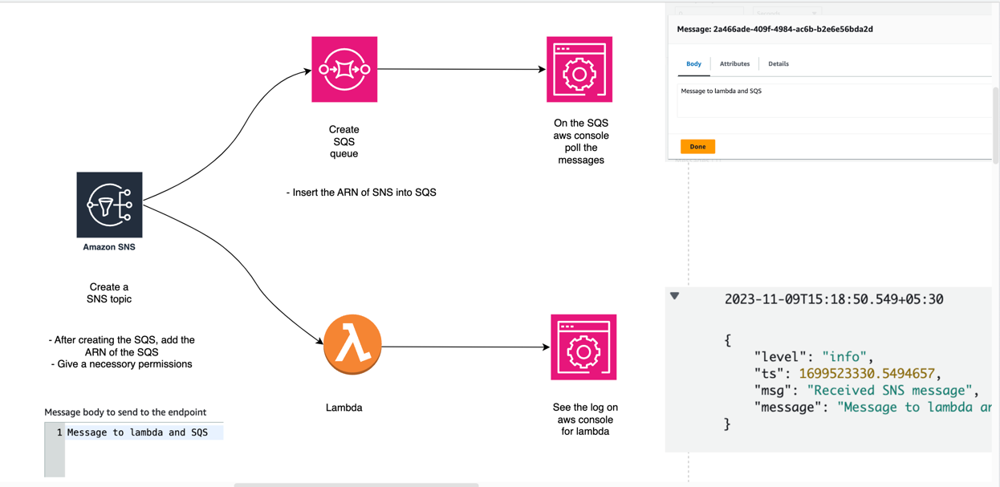
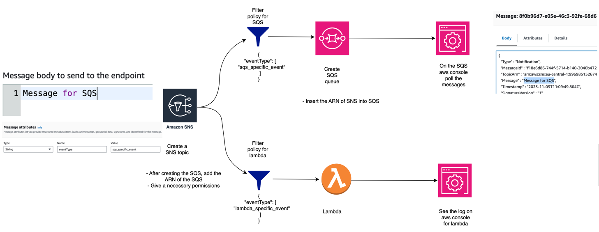
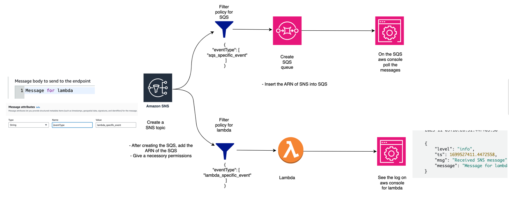

Add below policy to the SQS
```
{
  "Version": "2012-10-17",
  "Id": "__default_policy_ID",
  "Statement": [
    {
      "Sid": "__owner_statement",
      "Effect": "Allow",
      "Principal": {
        "AWS": "arn:aws:iam::996985152674:root"
      },
      "Action": "SQS:*",
      "Resource": "arn:aws:sqs:eu-central-1:996985152674:article"
    },
    {
      "Sid": "topic-subscription-arn:aws:sns:eu-central-1:996985152674:mytopic",
      "Effect": "Allow",
      "Principal": {
        "AWS": "*"
      },
      "Action": "SQS:SendMessage",
      "Resource": "arn:aws:sqs:eu-central-1:996985152674:article",
      "Condition": {
        "ArnLike": {
          "aws:SourceArn": "arn:aws:sns:eu-central-1:996985152674:mytopic"
        }
      }
    },
    {
      "Effect": "Allow",
      "Principal": {
        "Service": "sns.amazonaws.com"
      },
      "Action": "SQS:SendMessage",
      "Resource": "arn:aws:sqs:eu-central-1:996985152674:article",
      "Condition": {
        "ArnEquals": {
          "aws:SourceArn": "arn:aws:sns:eu-central-1:996985152674:mytopic"
        }
      }
    }
  ]
}

```
Send a same message to lambda and SQS


Insert the filter policy
### Send message to SQS with filter policy


### Send message to lambda using filter policy
