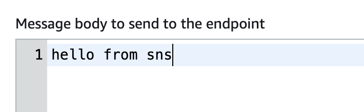
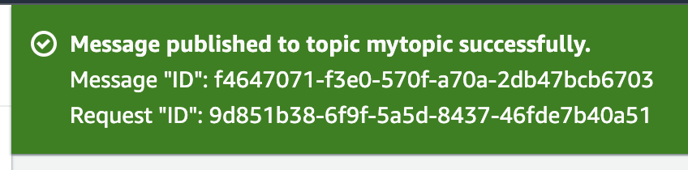
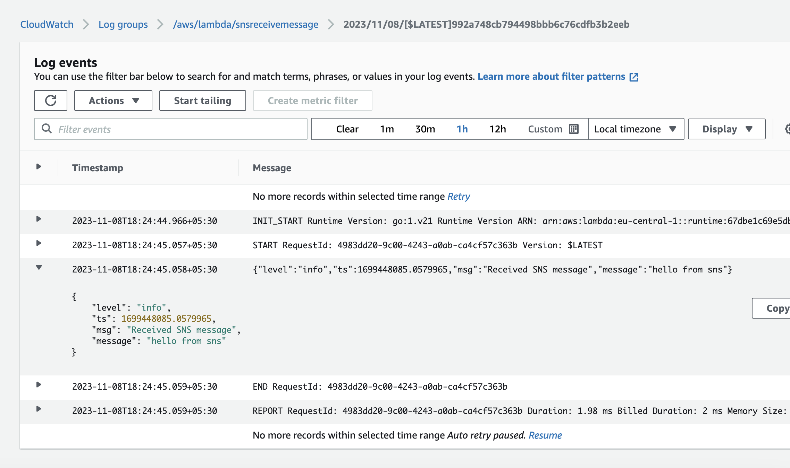

To generate the the arm 64 binary
---
```
GOOS=linux GOARCH=amd64 CGO_ENABLED=0 go build -o main main.go
```

To make the zip file
--
```
zip main.zip ./main
```

Sens a message from SNS topic


Message published


Lambda trigger and got the message



