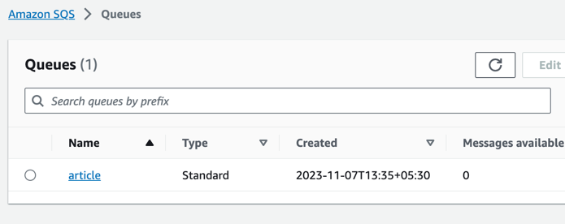
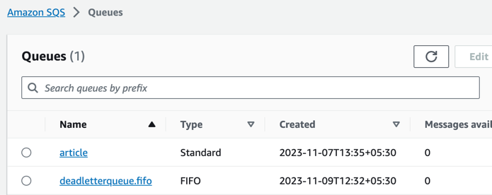
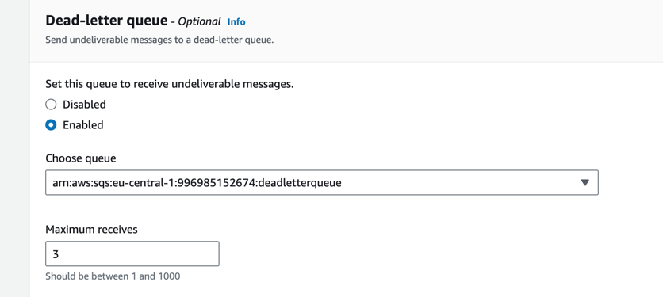
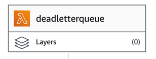
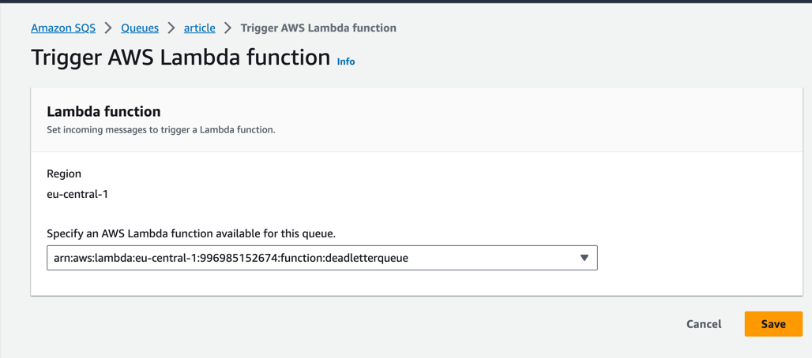
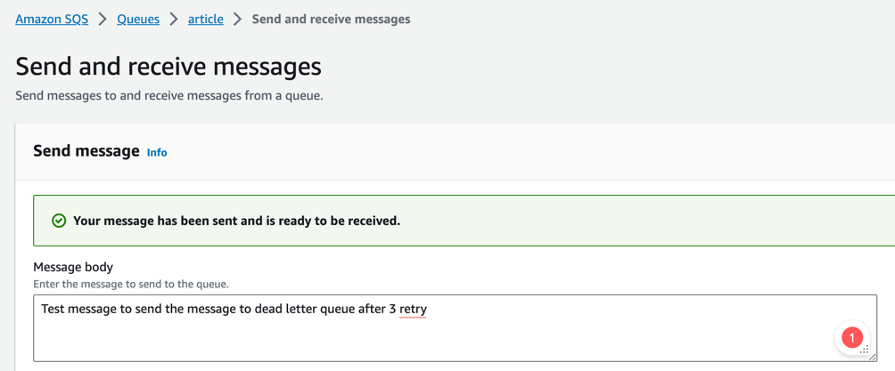
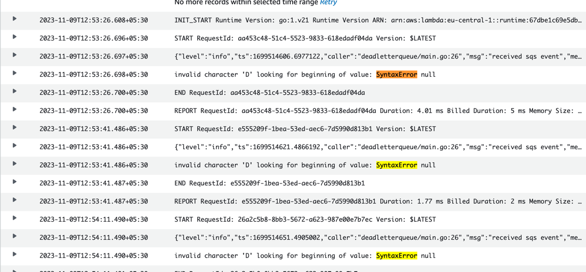
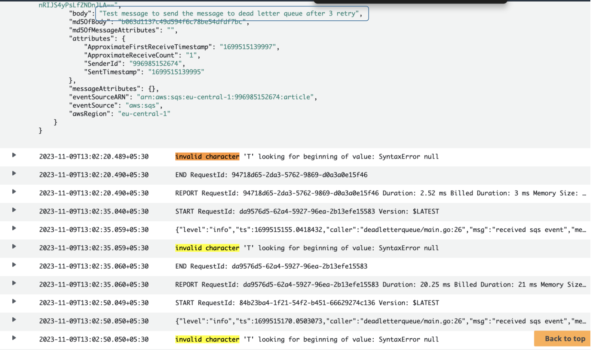
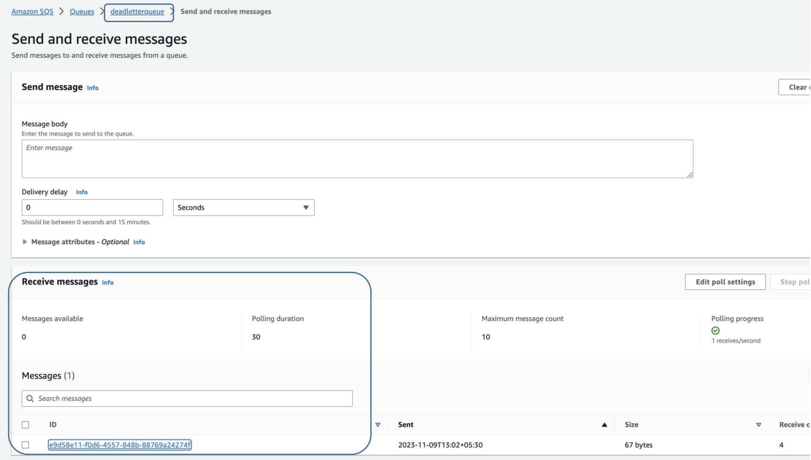
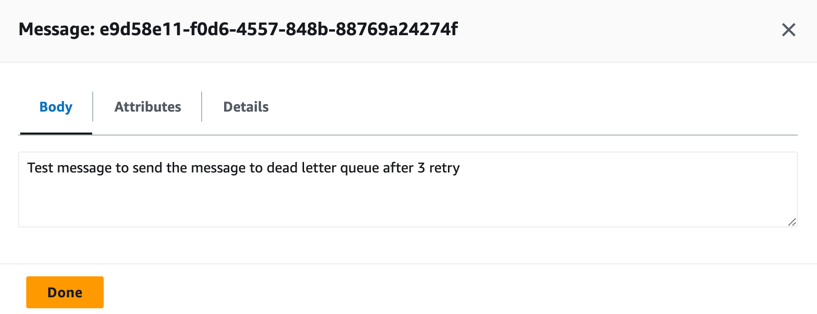

To generate the the arm 64 binary
---
```
GOOS=linux GOARCH=amd64 CGO_ENABLED=0 go build -o main main.go
```

To make the zip file
--
```
zip main.zip ./main
```
Create a queue


Create a deadletter queue


Update main queue with deadletter queue with 3 retry


Deploy lambda function



Subscribe the lamnda with SQS


Send message to SQS queue


- Got the 3 retry while checking the lambda log



Message comes but not consumes and delete by queue when lambda was triggered


Check the message on deadletter queue while polling


