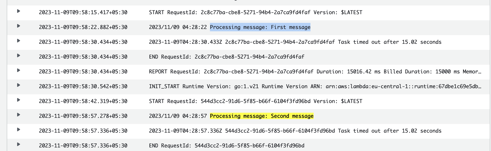

To generate the the arm 64 binary
---
```
GOOS=linux GOARCH=amd64 CGO_ENABLED=0 go build -o main main.go
```

To make the zip file
--

```
zip main.zip ./main
```
Receive 2 messages in single lambda call
- Lambda max wait time 15 sec
- Visibility time 10 sec
- Polling limit time 10 sec

