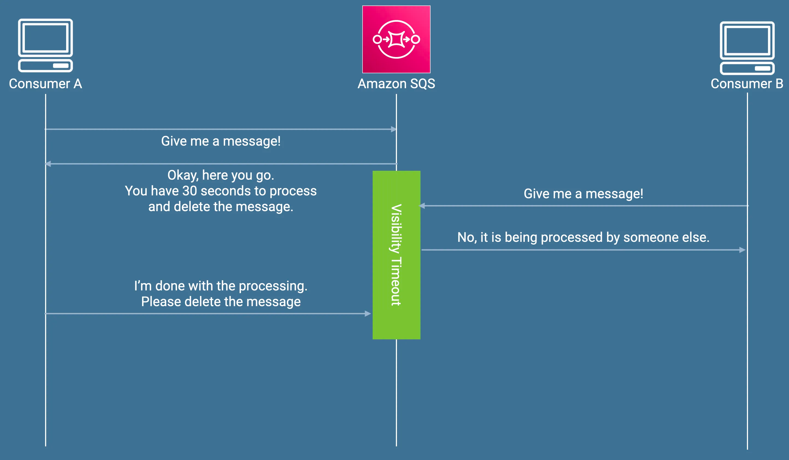
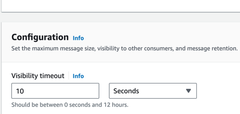
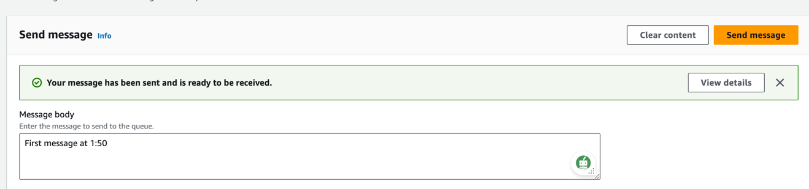
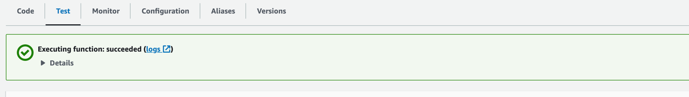
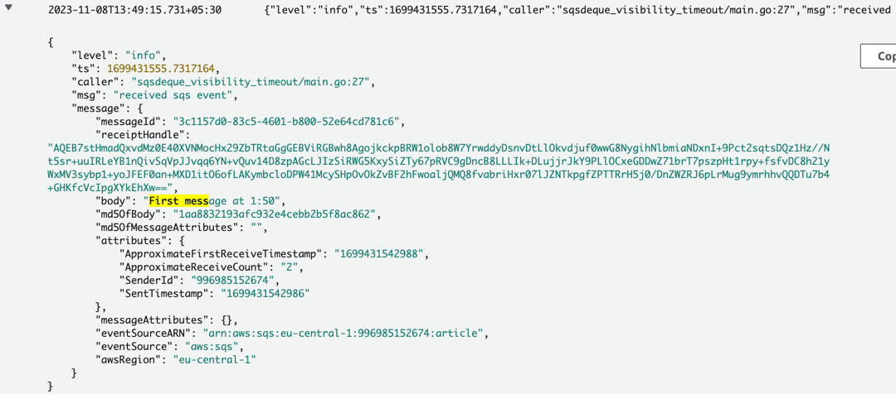
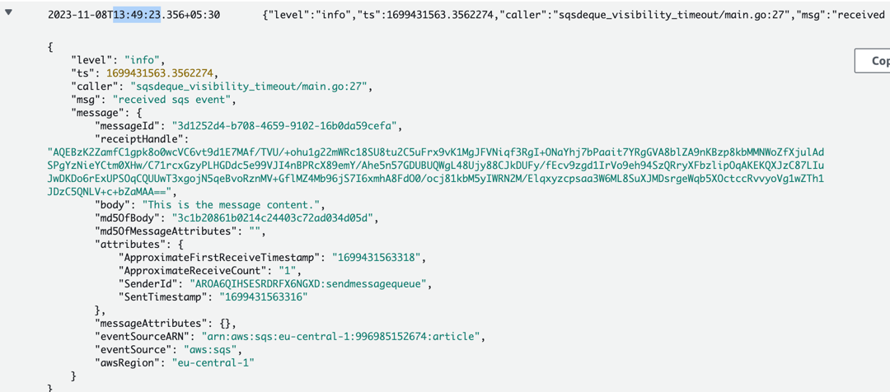

To generate the the arm 64 binary
---
```
GOOS=linux GOARCH=amd64 CGO_ENABLED=0 go build -o main main.go
```

To make the zip file
--
```
zip main.zip ./main
```

To checkout visibility timeout


Visibility timeout means the amount of time queue will give to consumer to consume and delete the message.
How to test it?
Set visibility timeout of 10 second



Send 1st message at 13:49:00


Send 2nd message at 13:49:12


On the log i will get 2 message when i received the 2nd message
The reason is
- 13:49:00 - 13:49:12 = 12 second
- Our visibilty timeout is 10 second 
- if message is not consume, process and delete then it will available for other consumer after 10 second of visibility timeout
due to that we got 2 messages.
- when we check the log after sending second message after 13:49:15 then we got 2 total messages instead of 1 message within a single lambda function.
2 messages from same lambda function is



Create the role
``` 
aws iam create-role \
    --role-name dequeuerole \
    --assume-role-policy-document '{
        "Version": "2012-10-17",
        "Statement": [
            {
                "Effect": "Allow",
                "Principal": {
                    "Service": "lambda.amazonaws.com"
                },
                "Action": "sts:AssumeRole"
            }
        ]
    }'
```
Create the iam policy
```
aws iam create-policy \
    --policy-name consumequeue-policy \
    --policy-document '{
        "Version": "2012-10-17",
        "Statement": [
            {
                "Effect": "Allow",
                "Action": [
                    "sqs:ReceiveMessage",
                    "sqs:DeleteMessage"
                ],
                "Resource": "arn:aws:sqs:region:996985152674:queue-name"
            }
        ]
    }'

```
Attatch the iam policy
```
aws iam attach-role-policy \
    --role-name consumequeue \
    --policy-arn arn:aws:iam::996985152674:policy/consumequeue-policy
```
Create the lambda function
```
aws lambda create-function \
    --function-name receivemessagefromqueue \
    --runtime go1.x \
    --handler main \
    --role arn:aws:iam::996985152674:role/consumequeue
    --zip-file fileb://main.zip

```
---
Referance
---
https://github.com/devtopics-yt/lambda-publish-sns-sqs

https://docs.aws.amazon.com/lambda/latest/dg/with-sqs-create-package.html

https://medium.com/event-driven-utopia/aws-sqs-visibility-timeout-explained-c13d8a728ab5

---


